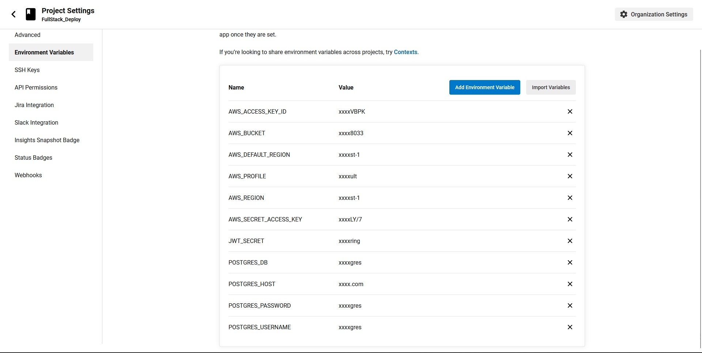

# Infrastructure Description

The application have `udagram/udagram-front` for the frontend and `udagram/udagram-api` for the backend

- The frontend is hosted on Amazon S3
- The Backend is hosted on Amazon Elastic Beanstalk
- The postgres Database is hosted on Amazon RDS

## Infrastructure Diagram

## Screenshots 

### RDS

### Elastic Beanstalk

### S3

### Pipeline

