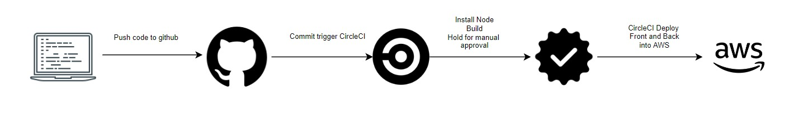

# Pipeline

The application use the integration of CircleCI with github, after each commit on the master branch, it will trigger CircleCI to deploy the application on AWS.

## Steps 

## CircleCI and AWS :

### Build

- Install Node/NPM
- Checkout the github repo code
- Install the dependencies for the Backend
- Build the Backend
- Install the dependencies for the Frontend
- Build the Frontend
- Lint FrontEnd

### Hold

- Need manual approval on CircleCI to trigger deployement

### Deploy 

- Setup AWS CLI
- Setup AWS Access Key ID
- Setup Elastic Beanstalk CLI
- Deploy backend
- Deploy frontend

